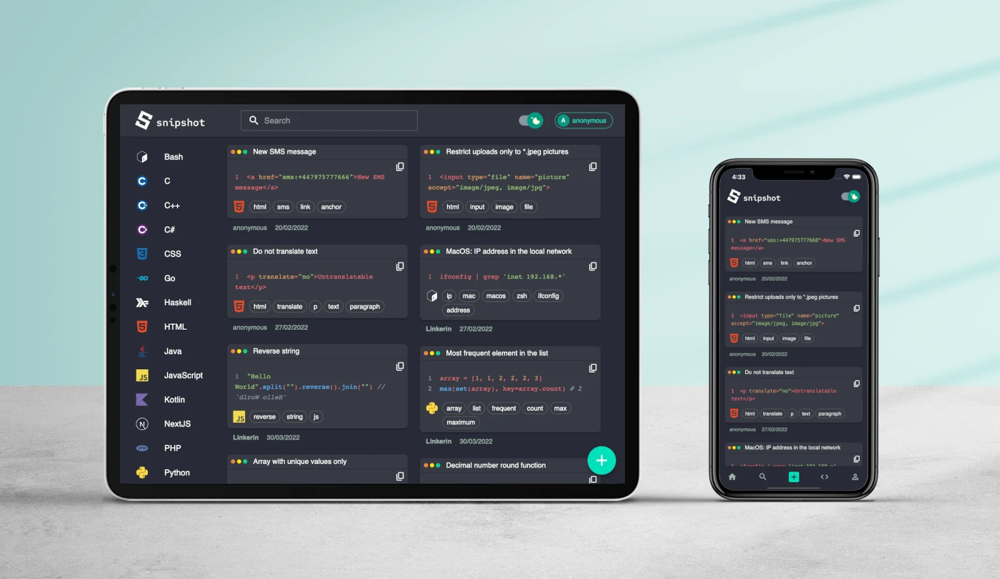
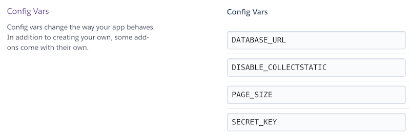

## Contents

[About](#about)  
[Distinctiveness and Complexity](#distinctiveness)  
[Technology stack](#tech-stack)  
[Deployment](#deployment)  
[Project structure](#structure)  
[Future features and plans](#plans)

## About <a id="about"></a>



[`snipshot`](https://snipshot.dev) is a web application for sharing code snippets. From time to time we use various one-liners and useful pieces of code that could be easily forgotten. Having separate files containing these code fragments is a common pratice for developers. With `snipshot` you now have a convenient place for storing your code snippets. Futhermore, you can also share your experiece and ideas through these snippet.`snipshot` is a source of inspiration, no less!

Application URL: [snipshot.dev](https://snipshot.dev)  
Video Demo: [`snipshot` for CS50W](https://youtu.be/sf1jSBhbXSs)

## Distinctiveness and Complexity <a id="distinctiveness"></a>

The idea of an application for storing and sharing code snippets is not similar to any other [CS50W](https://cs50.harvard.edu/web) projects. Moreover, there are no fully functional community-oriented applications for storing and sharing brief pieces of code.

There were 5 projects during CS50W course: [Google-like search web page](https://cs50.harvard.edu/web/2020/projects/0/search/), [Wikipedia-like encyclopedia](https://cs50.harvard.edu/web/2020/projects/1/wiki/), [E-commerce auction site](https://cs50.harvard.edu/web/2020/projects/2/commerce/), [Front-end for an email client](https://cs50.harvard.edu/web/2020/projects/3/mail/) and a [Twitter-like social network](https://cs50.harvard.edu/web/2020/projects/4/network/). `snipshot` is not similar to any of these projects, however it could be called a social network in some sort. `snipshot`'s main function of sharing code snippets and not one's ideas or personal messages makes it distinctive from other social networks and the Twitter-like project of this course in particular.

According to the requirements, backend part of the application is based on [Django](https://www.djangoproject.com) and [Django REST framework](https://www.django-rest-framework.org) and has 3 models: `User`, `Snippet` and `Tag` (q.v. [models.py](./server/api/models.py)) at the moment. As for mobile-responsive requirement, during `snipshot` development mobile-first approach was used. Thus, the mobile version of the application is as convenient as it could be. Frontend part is based on [Next.js](https://nextjs.org) that is a React-based JavaScript framework with [MUI](https://mui.com) under the hood that makes it a separate and complex application.

## Technology stack <a id="tech-stack"></a>

### Backend

[Django](https://www.djangoproject.com) and [Django REST framework](https://www.django-rest-framework.org) were used to develop a REST API backend that is hosted on [Heroku](https://www.heroku.com/). Heroku was chosen for its' free tier and Postgres database as a service. Heroku also utilizes [Gunicorn](https://gunicorn.org) as a WSGI HTTP Server. For testing and MVP purposes this backend stack showed itself perfectly.

### Frontend

Frontend application was develeped using [Next.js](https://nextjs.org) backed by [TypeScript](https://www.typescriptlang.org). As `snipshot` should be easily discovered by search engines, server-side rendering was one of the main requirements to the frontend application. Thus, plain [React](https://reactjs.org) was not enough. Next.js could be used for both SSR and SSG in one application, supports [Incremental Static Regeneration](https://nextjs.org/docs/basic-features/data-fetching/incremental-static-regeneration) and also allows using ordinary client-side data fetching when applicable. These features in addition to [TypeScript](https://www.typescriptlang.org) support determined the choice of Next.js for this project.

`snipshot`'s Next.js application is hosted on [Vercel](https://vercel.com). Vercel is a realible, ease-to-use and Next.js specialised platform that provides great user and developer experience.

Frontend part of the application tries not to rely much on third-party libraries, however some of them are used in the project. The first one and the main one is [MUI](https://mui.com). MUI was preffered to custom HTML/CSS due to its' responsiveness, familiar desing and user experience and popularity among developers. Using MUI during `snipshot` development allowed to get familiar with this UI library. Although MUI mostly accelerated development, sometimes the complexity of customisation greatly hampered the process.

Another library is [Axios](https://axios-http.com) for data fetching. Axios was prefered to browser's fetch API due to powerful [interceptors](https://axios-http.com/docs/interceptors) feature. (One of the future plan is nonetheless replace Axios with fetch API and reduce JavaScript bundle size). The other libraries are [lowlight](https://www.npmjs.com/package/lowlight) for syntax highlighting and [hast-to-hyperscript](https://www.npmjs.com/package/hast-to-hyperscript) for transforming tree structures produced by `lowlight` into React Elements.

## Deployment <a id="deployment"></a>

### Backend

Using Heroku eliminates the necessity of using [Docker](https://www.docker.com) for convenient backend deployment. Thus, the following steps basically describe setting up a local development server.

1. Inside the `/server/server` folder you should create `.env` file with variables mentioned in `.env.example` file:

   ```bash
   cd /server/server
   touch .env
   nano .env

   ```

   .env

   ```python
   PAGE_SIZE=10
   # Set here your secret key for Django application
   SECRET_KEY='YourSecretKey'
   DEBUG=False
   ```

   For Heroku you will need to set these variable in the dashboard: `Your application -> Settings -> Config Vars`. In addition, for Heroku you may need to use `DISABLE_COLLECTSTATIC` variable for proper deployment. Set it to `1`:

   ```
   DISABLE_COLLECTSTATIC 1
   ```

   

2. If you don't use Heroku, you should install all the required pip packages from the [requirements.txt](./server/requirements.txt) file using the following command:

   ```bash
   pip install -r requirements.txt
   ```

3. After that make database migrations:

   ```bash
   python manage.py makemigrations
   python manage.py migrate
   ```

4. Start the development Django server:

   ```bash
   python manage.py runserver
   ```

### Frontend

1. Install all npm dependencies from `package.json` inside the `client` folder:

   ```bash
   cd client
   npm install
   ```

2. Then inside the `client` folder you should create a `.env.local` with a backent API URL. The example file is `.env.local.example`.

   ```bash
   touch .env.local
   nano .env.local
   ```

   .env.local

   ```js
   NEXT_PUBLIC_API = YourBackendApiUrl;
   ```

3. You may start the development server using `npm run dev` command or make a production build and then start it locally with the following commands:

   ```bash
   npm run build
   npm run start
   ```

   After making all these steps the application should run on http://localhost:3000.

## Project structure <a id="structure"></a>

### Backend

```bash
├── server
│   ├── api
│   │   ├── migrations
│   │   ├── services
│   │   │   ├── __init__.py
│   │   │   ├── snippets.py
│   │   │   ├── users.py
│   │   ├── static
│   │   │   ├── .keep
│   │   ├── utils
│   │   │   ├── __init__.py
│   │   │   ├── constants.py
│   │   ├── __init__.py
│   │   ├── admin.py
│   │   ├── apps.py
│   │   ├── models.py
│   │   ├── serializers.py
│   │   ├── tests.py
│   │   ├── views.py
│   ├── server
│   │   ├── __init__.py
│   │   ├── .env
│   │   ├── .env.example
│   │   ├── asgi.py
│   │   ├── settings.py
│   │   ├── urls.py
│   │   ├── wsgi.py
│   ├── .gitignore
│   ├── manage.py
│   ├── Procfile
│   ├── requirements.txt
```

[`api`](./server/api) folder is an app folder that contains all the logic and models. [`server`](./server/server) folder contains settings and a controller.

`api` folder:

- `migrations` folder - database migrations files generated by Django.

- `services` folder - business logic of the backend application splitted in two main services: operations with `User` model ([users.py](./server/api/services/users.py)) and `Snippet` model ([snippets.py](./server/api/services/snippets.py)). These services handle all CRUD operations and partial data validation.

  - `snippets.py` - contains `SnippetService` class that implements methods for creating and reading snippets data from the database: `create`, `all_snippets`, `get_snippet`, `search`, `get_snippets_by_user`.
  - `users.py` - contains `UserService` to operate user's data: `register`, `get_user`, `change_password`.

- `static` folder - technical folder for proper Heroku deployment, contains an empty `.keep` file.

- `utils` folder - contains only [`constants.py`](./server/api/utils/constants.py) file with a tuple of all possible programming languages that the application operates with.

- `models.py` - contains declaration of `User`, `Snippet` and `Tag` classes that define database models.

- `serializers.py` - model serializer classes (`TagSerializer`, `CreateSnippetSerializer`, `UserSerializer`, `SnippetInfoSerializer` and `UserDtoSerializer`) for data input/output representation based on Django Rest Framework serializers. Serializers are used for data validation and convenient use on the frontend part of the application.

- `views.py` - views controller that handles url requests and processes services outputs. Functions declared inside `views.py`:

  - `register()` - register route handler;
  - `change_password()` - invokes user's password change service;
  - `user()` - returns registered user's data for his private page;
  - `user_profile()` - returns user's data for a public page;
  - `user_snippets()` - returns a list of snippets created by a particular user;
  - `snippets()` - create a new snippets or get all snippets;
  - `snippet()` - returns snippet data for its' own page;
  - `language_snippets()` - returns a list of snippets filtered by the stated programming language;
  - `search()` - search handler;
  - `tag_snippets()` - returns a list of snippets filtered by the stated tag.

- `admin.py` , `apps.py`, `tests.py` - default Django modules.

`server` folder:

- `.env` and `.env.example` - evironment variables file and its' example.

- `asgi.py` and `wsgi.py` - default Django ASGI and WSGI config files.

- `settings.py` - Django project settings file. Changes made to the `settings.py` file:

  - `SECRET_KEY` and `DEBUG` values are getting from environment variables;
  - added `ALLOWED_HOSTS` and `CORS_ALLOWED_ORIGINS` domains;
  - extended `INSTALLED_APPS` list;
  - added middleware for CORS handling;
  - defined static files directories;
  - defined User model under `AUTH_USER_MODEL` parameter;
  - added setting for Django Rest Framework (`REST_FRAMEWORK`) and Simple JWT authentication (`SIMPLE_JWT`).

- `urls.py` - backend API URL controller. Every path starts with `api/` prefix. Routes are divided into several main areas:
  - `/register/` - sign up a new user;
  - `/users/` - user related data;
  - `/snippets/` - snippets related data;
  - `/tags/` - snippets filtered by a certain tag;
  - `/token/` - JWT related routes.

Other files:

- `.gitignore` - list of files/folders ignored by git.
- `manage.py` - Django's command line utility file.
- `Procfile` - Heroku settings file.
- `requirements.txt` - list of this application pip packages dependencies.

### Frontend

```bash
├── client
│   ├── components
│   │   ├── Headers
│   │   │   ├── AvatarChip.tsx
│   │   │   ├── Header.tsx
│   │   │   ├── MobileHeader.tsx
│   │   │   ├── Search.tsx
│   │   │   ├── ThemeSwitch.tsx
│   │   ├── LangIcons
│   │   │   ├── BashIcon.tsx
│   │   │   ├── CIcon.tsx
│   │   │   ├── CPlusPlusIcon.tsx
│   │   │   ├── CSharpIcon.tsx
│   │   │   ├── CustomSvgIcon.tsx
│   │   │   ├── GoIcon.tsx
│   │   │   ├── HaskellIcon.tsx
│   │   │   ├── HtmlIcon.tsx
│   │   │   ├── JavaIcon.tsx
│   │   │   ├── JavaScriptIcon.tsx
│   │   │   ├── KotlinIcon.tsx
│   │   │   ├── LangIcon.tsx
│   │   │   ├── NextIcon.tsx
│   │   │   ├── OtherLangIcon.tsx
│   │   │   ├── PythonIcon.tsx
│   │   │   ├── ReactIcon.tsx
│   │   │   ├── RIcon.tsx
│   │   │   ├── RubyIcon.tsx
│   │   │   ├── RustIcon.tsx
│   │   │   ├── SqlIcon.tsx
│   │   │   ├── SwiftIcon.tsx
│   │   │   ├── TypeScriptIcon.tsx
│   │   ├── Meta
│   │   │   ├── Favicon.tsx
│   │   │   ├── Meta.tsx
│   │   ├── MobileNav
│   │   │   ├── LanguagesList.tsx
│   │   │   ├── MobileNav.tsx
│   │   │   ├── MobileNavModal.tsx
│   │   │   ├── Search.tsx
│   │   ├── Snippet
│   │   │   ├── Snippet.tsx
│   │   │   ├── SnippetCard.tsx
│   │   │   ├── SnippetCode.tsx
│   │   ├── AddSnippet.tsx
│   │   ├── FloatingAddBtn.tsx
│   │   ├── Layout.tsx
│   │   ├── Link.tsx
│   │   ├── Logo.tsx
│   │   ├── SearchBar.tsx
│   │   ├── SideMenu.tsx
│   │   ├── SnippetListItemLink.tsx
│   │   ├── SnippetList.tsx
│   ├── context
│   │   ├── AuthContext.tsx
│   │   ├── DeviceContext.tsx
│   │   ├── ThemeContext.tsx
│   ├── hooks
│   │   ├── useAuth.ts
│   │   ├── useButtonDisabled.ts
│   │   ├── useHovered.ts
│   │   ├── usePaginatedHandler.ts
│   │   ├── useScrollRef.ts
│   │   ├── useSnippetsArray.ts
│   ├── pages
│   │   ├── api
│   │   │   ├── ping.ts
│   │   ├── snippets
│   │   │   ├── [lang]
│   │   │   │   ├── [snippet].tsx
│   │   │   ├── [lang].tsx
│   │   │   ├── add.tsx
│   │   ├── tags
│   │   │   ├── [tag].tsx
│   │   ├── users
│   │   │   ├── [userpage].tsx
│   │   ├── _app.tsx
│   │   ├── _document.tsx
│   │   ├── index.tsx
│   │   ├── login.tsx
│   │   ├── profile.tsx
│   │   ├── register.tsx
│   ├── public
│   │   ├── favicons
│   │   ├── meta_image.png
│   ├── services
│   │   ├── apiAxios.ts
│   │   ├── Auth.ts
│   │   ├── constants.ts
│   │   ├── date.ts
│   │   ├── NextLocalStorage.ts
│   │   ├── snippets.ts
│   │   ├── theme.ts
│   │   ├── types.ts
│   │   ├── utils.ts
│   ├── styles
│   │   ├── globals.css
│   │   ├── snippetCode.css
│   ├── .env.local
│   ├── .env.local.example
│   ├── .eslintrc.json
│   ├── .gitignore
│   ├── next-env.d.ts
│   ├── next.config.json
│   ├── package-lock.json
│   ├── package.json
│   ├── tsconfig.json
```

- `componets` folder - React components used throughout the application:

  - `Headers` folder:

    - `AvatarChip.tsx` - user's avatar and username component showed inside a desktop header;
    - `Header.tsx` - desktop layout header component;
    - `MobileHeader.tsx` - mobile layout header component;
    - `Search.tsx` - search input and results representation component;
    - `ThemeSwitch.tsx` - dark/light mode toggle button component.

  - `LangIcons` folder:

    - `BashIcon.tsx` - Bash language svg icon component;
    - `CIcon.tsx` - C language svg icon component;
    - `CPlusPlusIcon.tsx` - C++ language svg icon component;
    - `CSharpIcon.tsx` - C# language svg icon component;
    - `CustomSvgIcon.tsx` - custom MUI-based svg icon component;
    - `GoIcon.tsx` - Go language svg icon component;
    - `HaskellIcon.tsx` - Haskell language svg icon component;
    - `HtmlIcon.tsx` - HTML language svg icon component;
    - `JavaIcon.tsx` - Java language svg icon component;
    - `JavaScriptIcon.tsx` - JavaScript language svg icon component;
    - `KotlinIcon.tsx` - Kotlin language svg icon component;
    - `LangIcon.tsx` - components that aggregates all programming language icon components;
    - `NextIcon.tsx` - Next.js svg icon component;
    - `OtherLangIcon.tsx` - svg icon component for any other programming languages;
    - `PythonIcon.tsx` - Python language svg icon component;
    - `ReactIcon.tsx` - React svg icon component;
    - `RIcon.tsx` - R language svg icon component;
    - `RubyIcon.tsx` - Ruby language svg icon component;
    - `RustIcon.tsx` - Rust language svg icon component;
    - `SqlIcon.tsx` - SQL language svg icon component;
    - `SwiftIcon.tsx` - Swift language svg icon component;
    - `TypeScriptIcon.tsx` - TypeScript language svg icon component.

  - `Meta` folder:

    - `Favicon.tsx` - HTML meta tags for favicons;
    - `Meta.tsx` - HTML meta tags component that could be used on any page.

  - `MobileNav` folder:

    - `LanguagesList.tsx` - list component of all supported programming languages with their icons;
    - `MobileNav.tsx` - navigation bar for mobile layout;
    - `MobileNavModal.tsx` - modal window component for mobile layout;
    - `Search.tsx` - search input and results representation component for mobile layout.

  - `Snippet` folder:

    - `Snippet.tsx` - main snippet component that wraps snippet card, author info and creation date;
    - `SnippetCard.tsx` - snippet card component that wraps around code component;
    - `SnippetCode.tsx` - code component with syntax highlight.

  - `AddSnippet.tsx` - component for adding a new snippet.
  - `FloatingAddBtn.tsx` - add snippet button component for desktop layout.
  - `Layout.tsx` - layout of the whole application.
  - `Link.tsx` - custom Link component that is supported by both MUI and Next.js.
  - `Logo.tsx` - application logo component.
  - `SearchBar.tsx` - search input component with fetching logic.
  - `SideMenu.tsx` - left aside navigation for desktop layout.
  - `SnippetListItemLink.tsx` - a link item component that navigated to the corresponding programming language page.
  - `SnippetsList.tsx` - a layout component for representation a list of snippet components.

- `context` folder:

  - `AuthContext.tsx` - React Context provider of authorization information;
  - `DeviceContext.tsx` - React Context provider of current user's device;
  - `ThemeContext.tsx` - React Context provider of current theme.

- `hooks` folder - custom React hooks:

  - `useAuth.ts`: a hook that returns an authorization value and set method from the Context and redirects unauthorized users to `/` or `/login` routes.
  - `useButtonDisabled.ts`: a hook that checks whether there are empty values or erros for the provided object. Returns a boolean value for buttons' `disabled` property.
  - `useHovered.ts`: a hook that provides a boolean value indicating whether the element is hovered or not and necessary handlers for `mouseenter` and `mouseleave` events.
  - `usePaginatedHandler.ts`: a hook that is used for fetching data from backend handlers with pagination.
  - `useScrollref.ts`: a hook that observes for element intersections.
  - `useSnippetsArray.ts`: a hook that converts `tags` and `insert_date` properties from backend snippets objects for proper use inside frontend application.

- `pages` folder - Next.js pages components:

  - `api` folder:

    - `ping.ts` - Next.js api route used to ping the application and check that it's online.

  - `snippets` folder:
    - `[lang]` folder:
      - `snippet.tsx` - a snippet page.
  - `[lang].tsx` - snippets page of a certain programming language;
  - `add.tsx` - add a new snippet page.

  - `tags` folder:

    - `[tag].tsx` - snippets page of a certain tag.

  - `users` folder:
    - `[userpage].tsx` - user's public profile page.
  - `_app.tsx` - custom App component that contains application layout and context providers.
  - `_document.tsx` - custom Document component used to set `<head>` info.
  - `index.tsx` - application homepage.
  - `login.tsx` - user login page.
  - `profile.tsx` - user's private profile page.
  - `register.tsx` - user sign up page.

- `public` folder - static files folder:

  - `favicons` folder - contains all variants of application's favicons and web manifest file.
  - `meta_image.png` - image that is used for [OpenGraph](https://www.ogp.me).

- `services` folder - various services used throughout the application:

  - `apiAxios.ts` - custom `Axios` instanse for fetching data from the backend API.
  - `Auth.ts` - singleton class for authorisation related methods: register, login, logout, change password and refresh JWT tokens.
  - `constants.ts`: contains a read-only array of all possible programming languages that the application operates.
  - `date.ts`: containes a `parseDate` function for proper date representation received from the backend.
  - `NextLocalStorage.ts`: a class representing `localStorage` standard methods with a client-side check necessary for Next.js.
  - `snippet.ts`: functions that are used for proper snippets highlight and representation.
  - `theme.ts`: MUI theme settings.
  - `types.ts`: custom types that are used throughout the application.
  - `utils.ts`: utility functions like `isAscii` character check.

- `styles` folder - global CSS files:

  - `globals.css` - CSS reset and main styling options.
  - `snippetCode.css` - CSS for code syntax highlight.

- `.env.local` and `.env.local.example` - evironment variables file and its' example.
- `.eslintrc.json` - ESLint configuration file.
- `.gitignore` - list of files/folders ignored by git.
- `next-env.d.ts` - Next.js types support by TypeScript compiler.
- `next.config.json` - Next.js configuration file.
- `package.json`: npm configuration and dependencies files.
- `tsconfig.json` - TypeScript configuration file.

## Future features and plans <a id="plans"></a>

- [x] Try [Supabase](https://supabase.com) as a backend alternative for Django.
- [ ] Add support for GitHub / Google authorization.
- [ ] Add fancy animations for better UI/UX.
- [ ] Add testing and logging.
- [x] Add ratings for snippets.
- [x] Add comments section on snippet's page.
- [ ] Add moderator role and 'validated' marks for snippets that were checked by moderators.
- [ ] Develop an admin site.
- [ ] Allow creation of 'private' snippets for user's personal use.
- [ ] Add 'share' menu and generate fancy 'screenshot' images for snippets.
- [ ] Consider support for markdown cheatsheets as another section of the application.

## README.md checklist

- [x] Multiple paragraphs in length.
- [x] Explanation why the project satisfies the [distinctiveness and complexity](#distinctiveness) requirements.
- [x] [A full write-up of all of the files](#structure) to which you've contributed code and what is contained in those files.
- [x] How to run the application: [Deployment](#deployment).
