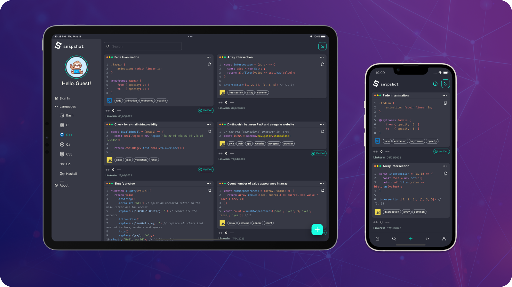

  

# About us

_snipshot_ is an application for developers to **store** and **share** their favorite code snippets with others.

With _snipshot_ your useful one-liners won't be forgotten. Futhermore, you can share your experience and ideas with others. Sounds like a source of **inspiration**, doesn't it?

Our platform is designed to be user-friendly and intuitive. Start using it [**now**](https://snipshot.dev/)!

